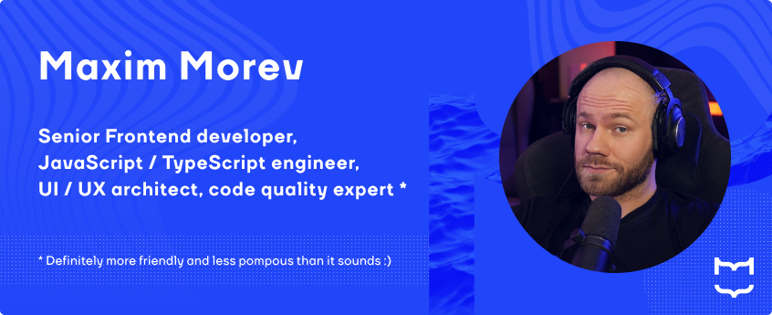

# Welcome!

I'm Maxim Morev, a web developer with 16 years of experience who is still interested and still cares.

My passion is everything about Frontend, especially:

* Client-side development, including UI/UX engineering;
* Solutions that improve DX and management processes;
* Mentorship, educating aspiring specialists.

I try to keep most of my solutions in Open Source and contribute to other projects as well.

**Contacts**: [Telegram](https://t.me/max_seainside) / [Email](mailto:max.seainside@gmail.com)

## I'm enthusiastic about:

### 🏆 Code quality, standardization and tech writing

<!-- Technologies & Tools -->

  <!-- ESLint -->
  <a href="https://eslint.org/" title="ESLint" target="_blank" rel="noopener noreferrer">
    <picture>
      <source media="(prefers-color-scheme: dark)" srcset="./.github/assets/logos/dark/eslint.svg" />
      
    </picture>
  </a>&nbsp;

  <!-- Stylelint -->
  <a href="https://stylelint.io/" title="Stylelint" target="_blank" rel="noopener noreferrer">
    <picture>
      <source media="(prefers-color-scheme: dark)" srcset="./.github/assets/logos/dark/stylelint.svg" />
      
    </picture>
  </a>&nbsp;

  <!-- Commitlint -->
  <a href="https://commitlint.js.org/" title="Commitlint" target="_blank" rel="noopener noreferrer">
    <picture>
      <source media="(prefers-color-scheme: dark)" srcset="./.github/assets/logos/dark/commitlint.svg" />
      
    </picture>
  </a>&nbsp;

  <!-- Git -->
  <a href="https://git-scm.com/" title="Git" target="_blank" rel="noopener noreferrer">
    <picture>
      <source media="(prefers-color-scheme: dark)" srcset="./.github/assets/logos/dark/git.svg" />
      
    </picture>
  </a>&nbsp;

  <!-- Lefthook -->
  <a href="https://evilmartians.com/opensource/lefthook" title="Lefthook" target="_blank" rel="noopener noreferrer">
    <picture>
      <source media="(prefers-color-scheme: dark)" srcset="./.github/assets/logos/dark/lefthook.svg" />
      
    </picture>
  </a>&nbsp;

  <!-- OpenAPI -->
  <a href="https://www.openapis.org/" title="OpenAPI" target="_blank" rel="noopener noreferrer">
    <picture>
      <source media="(prefers-color-scheme: dark)" srcset="./.github/assets/logos/dark/open-api.svg" />
      
    </picture>
  </a>&nbsp;

 

In teamwork, it is very important to ensure common standards to achieve a suitable level of code consistency
between specialists of different levels with different views, or even across different projects.

  
Blah, blah, blah, show me how

  ---

  * Check out [ESLint config](https://github.com/MorevM/eslint-config) that contains more than 1200 rules for the tools that I and the team use. \
    I review, update and extend it regularly (weekly, sometimes more often).
  * Take a look on [StyleLint config](https://github.com/MorevM/stylelint-config) that contains more than 200 rules for CSS and 70+ for SCSS,
    including autoformatting to maintain order within rules and properties and other good practices.
  * As a big fan of universal code beauty, I'm a member of [stylelint-stylistic](https://github.com/stylelint-stylistic) organization. \
    We're working on standardizing and maintaining stylistic rules, that are [no longer supported](https://github.com/stylelint/stylelint/issues/6961) by Stylelint itself.
  * [Commitlint config](https://github.com/MorevM/commitlint-config) provides a unified style of commits
    (using [Conventional commits](https://www.conventionalcommits.org/en/v1.0.0/) with ability to expand) and changelog generation.

---

### ⚙️ Shared solutions

<!-- Technologies & Tools -->

  <!-- TypeScript -->
  <a href="https://www.typescriptlang.org/" title="TypeScript" target="_blank" rel="noopener noreferrer">
    <picture>
      <source media="(prefers-color-scheme: dark)" srcset="./.github/assets/logos/dark/typescript.svg" />
      
    </picture>
  </a>&nbsp;

  <!-- JavaScript -->
  <a href="https://developer.mozilla.org/en-US/docs/Web/JavaScript" title="JavaScript" target="_blank" rel="noopener noreferrer">
    <picture>
      <source media="(prefers-color-scheme: dark)" srcset="./.github/assets/logos/dark/javascript.svg" />
      
    </picture>
  </a>&nbsp;

  <!-- SASS -->
  <a href="https://sass-lang.com/" title="SASS" target="_blank" rel="noopener noreferrer">
    <picture>
      <source media="(prefers-color-scheme: dark)" srcset="./.github/assets/logos/dark/sass.svg" />
      
    </picture>
  </a>&nbsp;

  <!-- PostCSS -->
  <a href="https://postcss.org/" title="PostCSS" target="_blank" rel="noopener noreferrer">
    <picture>
      <source media="(prefers-color-scheme: dark)" srcset="./.github/assets/logos/dark/postcss.svg" />
      
    </picture>
  </a>&nbsp;

  <!-- Vue -->
  <a href="https://vuejs.org/" title="Vue" target="_blank" rel="noopener noreferrer">
    <picture>
      <source media="(prefers-color-scheme: dark)" srcset="./.github/assets/logos/dark/vue.svg" />
      
    </picture>
  </a>&nbsp;

  <!-- Nuxt -->
  <a href="https://nuxt.com/" title="Nuxt" target="_blank" rel="noopener noreferrer">
    <picture>
      <source media="(prefers-color-scheme: dark)" srcset="./.github/assets/logos/dark/nuxt.svg" />
      
    </picture>
  </a>&nbsp;

  <!-- VSCode -->
  <a href="https://code.visualstudio.com/" title="VSCode" target="_blank" rel="noopener noreferrer">
    <picture>
      <source media="(prefers-color-scheme: dark)" srcset="./.github/assets/logos/dark/vscode.svg" />
      
    </picture>
  </a>&nbsp;

  <!-- NPM -->
  <a href="https://www.npmjs.com/" title="NPM" target="_blank" rel="noopener noreferrer">
    <picture>
      <source media="(prefers-color-scheme: dark)" srcset="./.github/assets/logos/dark/npm.svg" />
      
    </picture>
  </a>&nbsp;

 

I'm convinced that the smaller the codebase is, the better it is for the project.

Separating recurring elements into libraries, forming their public API in such a way 
that they can be used for all purposes is not an easy task, requiring large expertise and wide experience. \
As an extremely T-shaped specialist, I'm coping with it so far :)

  
Blah, blah, show me the code

   

  > Of course, most solutions are under NDA, but there are also some in Open Source.

  * [`@morev/utils`](https://github.com/MorevM/utils) \
    100+ fully typed JavaScript utilities for everyday use.
  * [`more-sass`](https://github.com/MorevM/more-sass) \
    The library of useful SCSS mixins and functions.
  * [`@morev/vue-transitions`](https://github.com/MorevM/vue-transitions/) \
    Reusable interface transitions library for Vue2/Vue3 both.
  * [`@morev/equal-heights`](https://github.com/MorevM/equal-heights/) \
    Framework agnostic solution to emulate [CSS Subgrid](hhttps://developer.mozilla.org/en-US/docs/Web/CSS/CSS_grid_layout/Subgrid).
  * [`postcss-specificity-decorator`](https://github.com/MorevM/utils) \
    PostCSS Plugin to increase the specificity of selectors via decorator-like syntax.

  There are many others! You can find the rest under the ["Repositories" tab in my account](https://github.com/MorevM?tab=repositories).

---

### 🎨 UI/UX architecture

<!-- Technologies & Tools -->

  <!-- Figma -->
  <a href="https://www.figma.com/" title="Figma" target="_blank" rel="noopener noreferrer">
    <picture>
      <source media="(prefers-color-scheme: dark)" srcset="./.github/assets/logos/dark/figma.svg" />
      
    </picture>
  </a>&nbsp;

  <!-- Google Analytics -->
  <a href="https://marketingplatform.google.com/about/analytics/" title="Google Analytics" target="_blank" rel="noopener noreferrer">
    <picture>
      <source media="(prefers-color-scheme: dark)" srcset="./.github/assets/logos/dark/ga.svg" />
      
    </picture>
  </a>&nbsp;

  <!-- Yandex Metrika -->
  <a href="https://metrika.yandex.ru/" title="Yandex.Metrika" target="_blank" rel="noopener noreferrer">
    <picture>
      <source media="(prefers-color-scheme: dark)" srcset="./.github/assets/logos/dark/metrika.svg" />
      
    </picture>
  </a>&nbsp;

 

Modern frontend development does not exist in isolation from design. \
Design does not exist in isolation from analytics, or at least the experience of building interfaces and gathering feedback.

  
So, what are you talking about?

  ---

  It's all about creating and **maintaining** a design systems based on user analytics and the web in general. \
  This is the best way to speed up development and preserve maintainability and consistency. I know how to do this. \
  In general, I believe that "UX" is pretty good at standardizing and fitting into guidelines if there is enough visual experience and proper component design.

  > I'm a design-savvy programmer, not a designer who understands something about code. \
  > This means I'm unlikely to create a "wow!" design concept, but I'm definitely the best person to tidy up an existing one
  > and ensure further communication between frontenders and designers in a way that doesn't hurt.

---

### 👨‍💻 Frontend development

<!-- Technologies & Tools -->

  <!-- TypeScript -->
  <a href="https://www.typescriptlang.org/" title="TypeScript" target="_blank" rel="noopener noreferrer">
    <picture>
      <source media="(prefers-color-scheme: dark)" srcset="./.github/assets/logos/dark/typescript.svg" />
      
    </picture>
  </a>&nbsp;

  <!-- JavaScript -->
  <picture>
    <source media="(prefers-color-scheme: dark)" srcset="./.github/assets/logos/dark/javascript.svg" />
    
  </picture>&nbsp;

  <!-- SASS -->
  <a href="https://sass-lang.com/" title="SASS" target="_blank" rel="noopener noreferrer">
    <picture>
      <source media="(prefers-color-scheme: dark)" srcset="./.github/assets/logos/dark/sass.svg" />
      
    </picture>
  </a>&nbsp;

  <!-- Vue -->
  <a href="https://vuejs.org/" title="Vue" target="_blank" rel="noopener noreferrer">
    <picture>
      <source media="(prefers-color-scheme: dark)" srcset="./.github/assets/logos/dark/vue.svg" />
      
    </picture>
  </a>&nbsp;

  <!-- Nuxt -->
  <a href="https://nuxt.com/" title="Nuxt" target="_blank" rel="noopener noreferrer">
    <picture>
      <source media="(prefers-color-scheme: dark)" srcset="./.github/assets/logos/dark/nuxt.svg" />
      
    </picture>
  </a>&nbsp;

 

All of the above is fine, but I believe it's also important to do "day-to-day" development to stay good at it.

  
How do you do it?

  ---

  Lately I've been doing a lot more consulting than developing on my own,
  but either way it keeps me connected to real-world problems and lets me call myself a "playing coach".

  Some of my publicly available projects that I can tell you about my participation in: 

  * <https://uflor.ru/>
  * <https://championtool.ru/>
  * <https://prostudio.ru/>

---

### 🖥️ Web platform solutions

<!-- Technologies & Tools -->

  <!-- HTML5 -->
  <picture>
    <source media="(prefers-color-scheme: dark)" srcset="./.github/assets/logos/dark/html5.svg" />
    
  </picture>&nbsp;

  <!-- CSS3 -->
  <picture>
    <source media="(prefers-color-scheme: dark)" srcset="./.github/assets/logos/dark/css3.svg" />
    
  </picture>&nbsp;

  <!-- SVG -->
  <picture>
    <source media="(prefers-color-scheme: dark)" srcset="./.github/assets/logos/dark/svg.svg" />
    
  </picture>&nbsp;

  <!-- JavaScript -->
  <picture>
    <source media="(prefers-color-scheme: dark)" srcset="./.github/assets/logos/dark/javascript.svg" />
    
  </picture>&nbsp;

 

I started out as a "webmaster" 16 years ago when there were almost no additional frontend tools (there's a whole zoo now, eh)
that provides knowledge of the platform (and I love it, still).

Frameworks and additional tooling come and go, while the platform is always relevant.

---

## 🔠 Other tools I am familiar with:

### Frontend frameworks

<!-- Technologies & Tools -->

  <!-- Vue -->
  <a href="https://vuejs.org/" title="Vue" target="_blank" rel="noopener noreferrer">
    <picture>
      <source media="(prefers-color-scheme: dark)" srcset="./.github/assets/logos/dark/vue.svg" />
      
    </picture>
  </a>&nbsp;

  <!-- React -->
  <a href="https://react.dev/" title="React" target="_blank" rel="noopener noreferrer">
    <picture>
      <source media="(prefers-color-scheme: dark)" srcset="./.github/assets/logos/dark/react.svg" />
      
    </picture>
  </a>&nbsp;

  <!-- Astro -->
  <a href="https://astro.build/" title="Astro" target="_blank" rel="noopener noreferrer">
    <picture>
      <source media="(prefers-color-scheme: dark)" srcset="./.github/assets/logos/dark/astro.svg" />
      
    </picture>
  </a>&nbsp;

 

My main expertise is Vue, I love and believe in this framework. I have been working with it for the last 5 years.

  
What about the others?

  ---

  Familiar with React, but without a deep dive into the ecosystem. \
  I like Astro conceptually, right now I'm developing my own site on it,
  because I want to achieve maximum client performance keeping DX relatively compared to Vue.

  I haven't come across Svelte, Solid and Angular in real work, but would like to get better with them, if there are any offers.

---

### Testing frameworks

<!-- Technologies & Tools -->

  <!-- Vitest -->
  <a href="https://vitest.dev/" title="Vitest" target="_blank" rel="noopener noreferrer">
    <picture>
      <source media="(prefers-color-scheme: dark)" srcset="./.github/assets/logos/dark/vitest.svg" />
      
    </picture>
  </a>&nbsp;

  <!-- Jest -->
  <a href="https://jestjs.io/" title="Jest" target="_blank" rel="noopener noreferrer">
    <picture>
      <source media="(prefers-color-scheme: dark)" srcset="./.github/assets/logos/dark/jest.svg" />
      
    </picture>
  </a>&nbsp;

  <!-- Playwright -->
  <a href="https://playwright.dev/" title="Playwright" target="_blank" rel="noopener noreferrer">
    <picture>
      <source media="(prefers-color-scheme: dark)" srcset="./.github/assets/logos/dark/playwright.svg" />
      
    </picture>
  </a>&nbsp;

  <!-- Cypress -->
  <a href="https://www.cypress.io/" title="Cypress" target="_blank" rel="noopener noreferrer">
    <picture>
      <source media="(prefers-color-scheme: dark)" srcset="./.github/assets/logos/dark/cypress.svg" />
      
    </picture>
  </a>&nbsp;

 

  
What do you prefer?

  ---

  If I have a choice, I prefer to use [Vitest](https://vitest.dev/) for unit tests
  and [Playwright](https://playwright.dev/) for end-to-end testing, but I'm familiar with others as well.

  Actually, I believe that the specific tool is not very important -
  it's the overall understanding and culture of testing that matters.

---

### Bundlers / task runners

<!-- Technologies & Tools -->

  <!-- Vite -->
  <a href="https://vitejs.dev/" title="Vite" target="_blank" rel="noopener noreferrer">
    <picture>
      <source media="(prefers-color-scheme: dark)" srcset="./.github/assets/logos/dark/vite.svg" />
      
    </picture>
  </a>&nbsp;

  <!-- Webpack -->
  <a href="https://webpack.js.org/" title="Webpack" target="_blank" rel="noopener noreferrer">
    <picture>
      <source media="(prefers-color-scheme: dark)" srcset="./.github/assets/logos/dark/webpack.svg" />
      
    </picture>
  </a>&nbsp;

  <!-- Rollup -->
  <a href="https://rollupjs.org/" title="Rollup" target="_blank" rel="noopener noreferrer">
    <picture>
      <source media="(prefers-color-scheme: dark)" srcset="./.github/assets/logos/dark/rollup.svg" />
      
    </picture>
  </a>&nbsp;

  <!-- Gulp -->
  <a href="https://gulpjs.com/" title="Gulp" target="_blank" rel="noopener noreferrer">
    <picture>
      <source media="(prefers-color-scheme: dark)" srcset="./.github/assets/logos/dark/gulp.svg" />
      
    </picture>
  </a>&nbsp;

 

  
Tell me a few words about it

  ---

  I prefer to use [Vite](https://vite.dev/) if possible - for ease of configuration, extensibility, speed and out-of-box TS support. \
  I've encountered writing plugins/transformers under Webpack and Vite (by the way, check out [unplugin](https://github.com/unjs/unplugin) if need that too).

  Task runners... for a while I thought they had their uses, but now I think it's easier to just use native `scripts` instead,
  a task runner is just an unnecessary dependency that's losing popularity.

  I'm following the [Void Zero](https://voidzero.dev/) initiative with interest and what it will evolve into.
  Might have to learn Rust :)

---

#### Graphic design

<!-- Technologies & Tools -->

  <!-- Figma -->
  <a href="https://figma.com/" title="Figma" target="_blank" rel="noopener noreferrer">
    <picture>
      <source media="(prefers-color-scheme: dark)" srcset="./.github/assets/logos/dark/figma.svg" />
      
    </picture>
  </a>&nbsp;

  <!-- Photoshop -->
  <a href="https://www.adobe.com/products/photoshop.html" title="Photoshop" target="_blank" rel="noopener noreferrer">
    <picture>
      <source media="(prefers-color-scheme: dark)" srcset="./.github/assets/logos/dark/photoshop.svg" />
      
    </picture>
  </a>&nbsp;

  <!-- Illustrator -->
  <a href="https://www.adobe.com/products/illustrator.html" title="Illustrator" target="_blank" rel="noopener noreferrer">
    <picture>
      <source media="(prefers-color-scheme: dark)" srcset="./.github/assets/logos/dark/illustrator.svg" />
      
    </picture>
  </a>&nbsp;

 

  
Lol, why did you ever put it here?

  ---

  Well, this is a non-core thing at all, but do you know how many times I've seen project deadlines pushed back
  because there was a formal excuse like "the designer didn't finish something or did something wrong"? :)

  If necessary I'll finish/draw/edit/fix icons/layouts/components/raster graphics on my own without involving a profile specialist.
  Sometimes it saves a lot of time and attention.

---

#### Backend-related

<!-- Technologies & Tools -->

  <!-- NodeJS -->
  <a href="https://nodejs.org/" title="NodeJS" target="_blank" rel="noopener noreferrer">
    <picture>
      <source media="(prefers-color-scheme: dark)" srcset="./.github/assets/logos/dark/nodejs.svg" />
      
    </picture>
  </a>&nbsp;

  <!-- PHP -->
  <a href="https://www.php.net/" title="PHP" target="_blank" rel="noopener noreferrer">
    <picture>
      <source media="(prefers-color-scheme: dark)" srcset="./.github/assets/logos/dark/php.svg" />
      
    </picture>
  </a>&nbsp;

 

  
So, you're a fullstack engineer?

  ---

  Years ago I was relatively good at it, but for the last 5 years or so I've hardly ever come across it, meaning developing on my own. \
  Nevertheless - understanding remains, which allows better communication with related specialists and this is important when designing systems.

---

#### Infrastructure-related

<!-- Technologies & Tools -->

  <!-- nginx -->
  <a href="https://nginx.org/" title="nginx" target="_blank" rel="noopener noreferrer">
    <picture>
      <source media="(prefers-color-scheme: dark)" srcset="./.github/assets/logos/dark/nginx.svg" />
      
    </picture>
  </a>&nbsp;

  <!-- NPM -->
  <a href="https://www.npmjs.com/" title="NPM" target="_blank" rel="noopener noreferrer">
    <picture>
      <source media="(prefers-color-scheme: dark)" srcset="./.github/assets/logos/dark/npm.svg" />
      
    </picture>
  </a>&nbsp;

  <!-- Docker -->
  <a href="https://www.docker.com/" title="Docker" target="_blank" rel="noopener noreferrer">
    <picture>
      <source media="(prefers-color-scheme: dark)" srcset="./.github/assets/logos/dark/docker.svg" />
      
    </picture>
  </a>&nbsp;

  <!-- Github -->
  <a href="https://github.com/" title="Github" target="_blank" rel="noopener noreferrer">
    <picture>
      <source media="(prefers-color-scheme: dark)" srcset="./.github/assets/logos/dark/github.svg" />
      
    </picture>
  </a>&nbsp;

  <!-- Gitlab -->
  <a href="https://gitlab.com/" title="Gitlab" target="_blank" rel="noopener noreferrer">
    <picture>
      <source media="(prefers-color-scheme: dark)" srcset="./.github/assets/logos/dark/gitlab.svg" />
      
    </picture>
  </a>&nbsp;

 

  
So, you're a DevOps as well?

  ---

  I would say FrontOps, ha-ha. I once joked that I could replace a small IT department with just myself :) \
  But for now, it's the same as it is with the backend - my focus has shifted heavily towards the frontend in the last few years.

---

## 💵 Job offers

I am not actively looking for a job right now, however if you feel like I am exactly who you are looking for - let's talk about. \
Just [message me on Telegram](https://t.me/max_seainside) or [email me](mailto:max.seainside@gmail.com).

I'd be happy to work on a product I'll believe in,
and if there are people in the team who really care about what they're doing - people like me.

---

## 📊 GitHub Stats:

  <picture>
    <source media="(prefers-color-scheme: dark)" srcset="https://github-readme-stats.vercel.app/api?username=morevm&theme=holi&hide_border=true&include_all_commits=true&count_private=true&rank_icon=github&card_width=420&ring_color=2145f8&title_color=5da6e7&bg_color=1a1f25" />
    
  </picture>

  <picture>
    <source media="(prefers-color-scheme: dark)" srcset="https://github-readme-streak-stats.herokuapp.com?user=morevm&theme=highcontrast&hide_border=true&card_width=420&background=1A1F25&stroke=FFFFFF11&sideNums=5DA6E7&ring=1C3AD3&fire=5DA6E7&currStreakLabel=FFFFFF&sideLabels=FFFFFF&hide_longest_streak=true" />
    
  </picture>

  <picture>
    <source media="(prefers-color-scheme: dark)" srcset="https://github-readme-stats.vercel.app/api/top-langs/?username=morevm&theme=holi&hide_border=true&include_all_commits=false&count_private=true&layout=compact&card_width=846&bg_color=1A1F25&title_color=5da6e7" />
    
  </picture>

---

